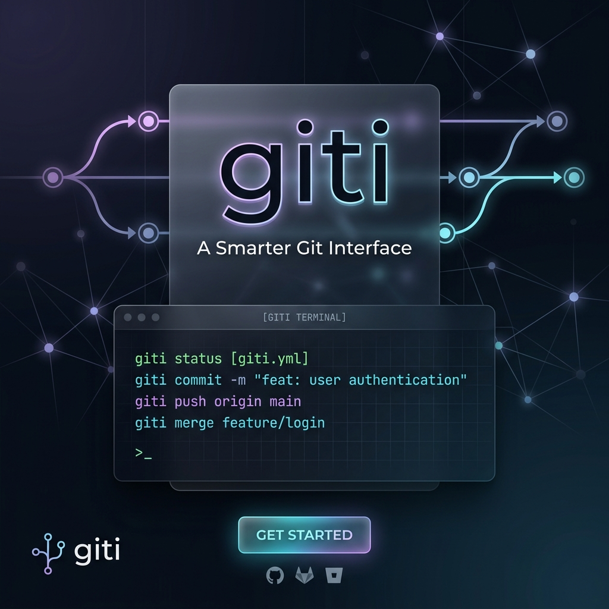

# 🌌 giti

[](https://www.npmjs.com/package/@nikhil2004-blip/giti-go)
[](https://opensource.org/licenses/MIT)

> **Natural-language Git command lookup — hybrid, fuzzy, instant.**



**Package name:** `@nikhil2004-blip/giti-go` | **CLI command:** `giti`

---

## 📦 Install

Choose your preferred installation method:

```bash
npm install -g @nikhil2004-blip/giti-go
```

After installation, run the tool simply with `giti`.

---

## 🚀 Quick Start

Run `giti` with a plain-English Git question:

```bash
giti remove staged file
giti i messed up last commit
giti remve stagd file          # typos handled automatically
giti who changed this file
giti squash last 3 commits
```

---

## 🤖 AI Suggestions

Offline commands work instantly without any setup. For complex or conversational queries, add your **Groq API key**:

```bash
giti --auth <YOUR_GROQ_API_KEY>
```

Get a free key at [console.groq.com/keys](https://console.groq.com/keys).

---

## 🛠 Usage

Simply run the `giti` command with your query in plain English:

```bash
giti <your question in plain English>
```

---

## 🧪 Before You Launch

Recommended local checks before publishing or tagging a release:

```bash
npm test
npm pack --dry-run
```

---

## 🚢 Publishing

If you are publishing the package yourself, the npm package name is `@nikhil2004-blip/giti-go` and the CLI command stays `giti`:

```bash
git add .
git commit -m "Prepare giti release"
git push origin master
npm login
npm publish
```

*The package is configured for public publishing, so you do not need to pass `--access public` manually.*

---

## 🛡 Security Notes

- **Encrypted Storage**: Saved API keys are stored locally with encryption or OS-backed protection where available.
- **Validation**: AI output is validated before it is shown to prevent injection.
- **Privacy**: Missed-query logs are redacted and size-limited.
- **Abuse Prevention**: AI fallback is rate-limited.

---

## 💡 Examples

| Query | Top Result |
|---|---|
| `giti unstage file` | `git restore --staged <file>` |
| `giti delete remote branch` | `git push origin --delete <name>` |
| `giti see commit graph` | `git log --graph --oneline --all` |
| `giti cherry pick commit` | `git cherry-pick <commit>` |
| `giti force push` | `git push --force-with-lease` |
| `giti find when bug introduced` | `git bisect start` |

---

## ✨ Features

- **Hybrid Engine** — Uses a fast offline matcher for standard commands and AI for complex ones.
- **BYOK (Bring Your Own Key)** — Set your own API key to get personal quota and privacy.
- **Fuzzy matching** — Handles typos, slang, and synonym expansion.
- **Lightning Fast** — < 100ms response for offline matches.
- **Secure by default** — Encrypted local storage and sanitized AI output.

---

## 📜 Helpful Commands

- `giti --help` - Show help
- `giti --version` - Show version
- `giti --learn` - Show unmatched queries
- `giti --completion=<shell>` - Generate shell completion for bash, zsh, or fish

---

## ⚖ License

MIT
